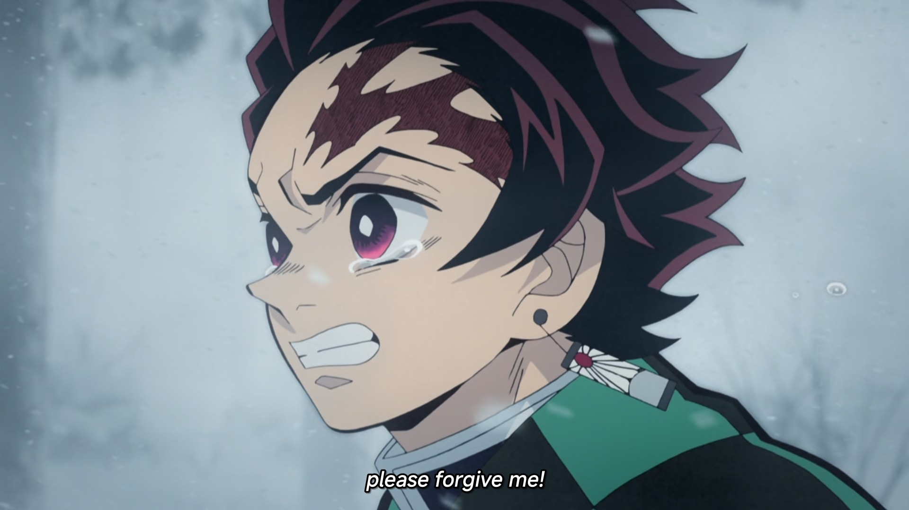
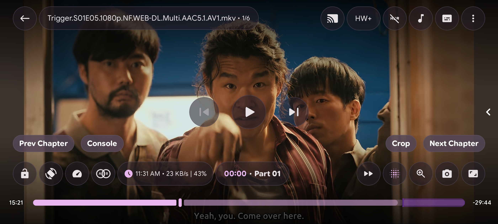
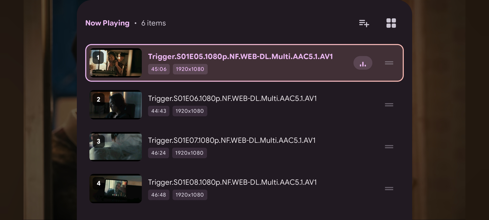
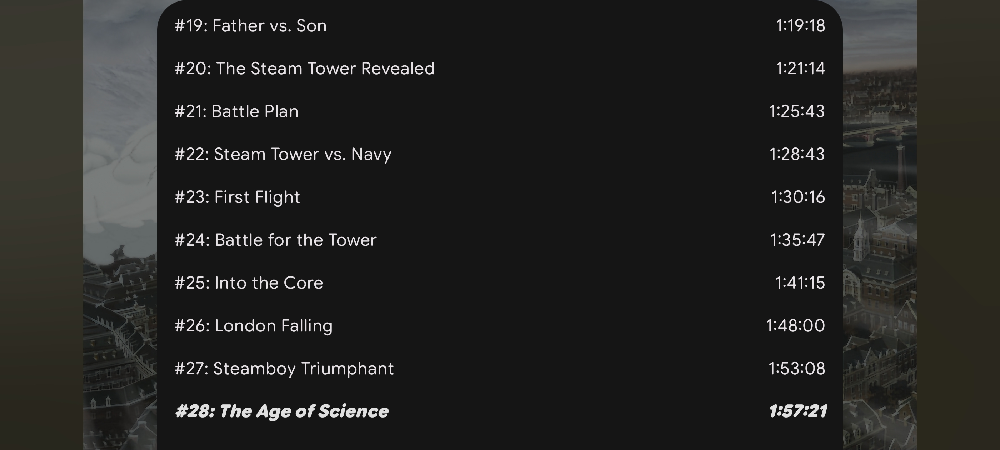
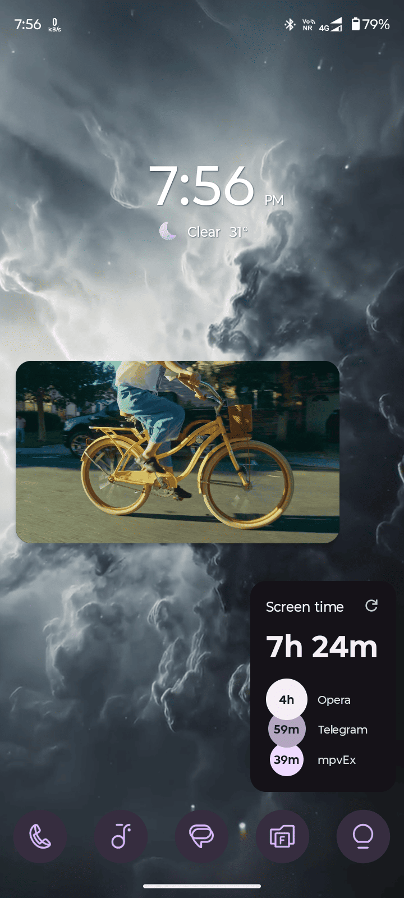
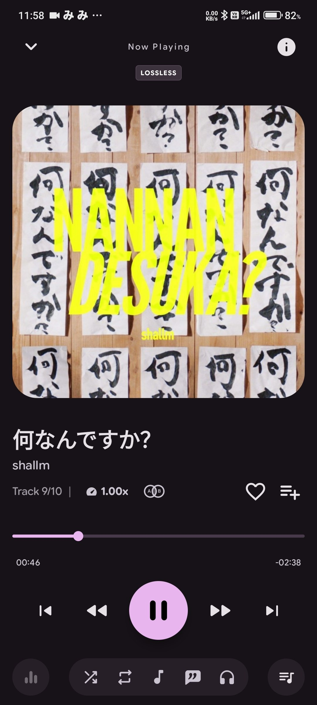
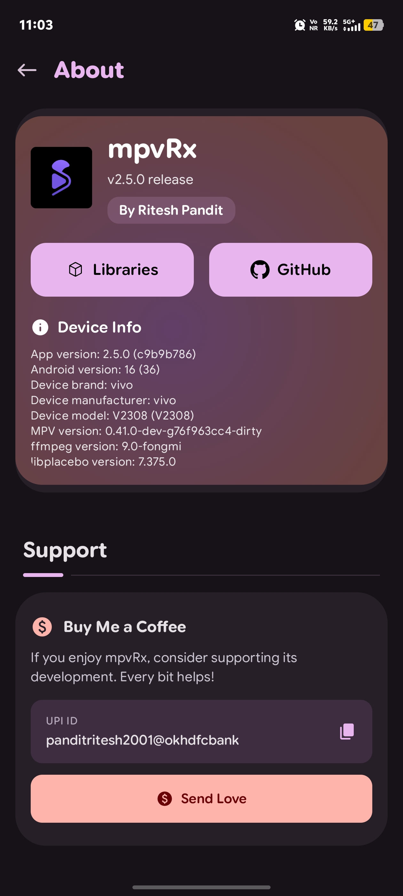

<p align="center">
  
</p>

<h1 align="center">mpvRx</h1>

<p align="center">
  <a href="https://apps.obtainium.imranr.dev/redirect?r=obtainium://app/%7B%22id%22%3A%22app.gyrolet.mpvrx%22%2C%22url%22%3A%22https%3A%2F%2Fgithub.com%2FRiteshp2001%2FmpvRx%22%2C%22author%22%3A%22Riteshp2001%22%2C%22name%22%3A%22mpvRx%22%2C%22preferredApkIndex%22%3A0%2C%22additionalSettings%22%3A%22%7B%5C%22includePrereleases%5C%22%3Afalse%2C%5C%22fallbackToOlderReleases%5C%22%3Atrue%2C%5C%22filterReleaseTitlesByRegEx%5C%22%3A%5C%22%5C%22%2C%5C%22filterReleaseNotesByRegEx%5C%22%3A%5C%22%5C%22%2C%5C%22verifyLatestTag%5C%22%3Afalse%2C%5C%22sortMethodChoice%5C%22%3A%5C%22date%5C%22%2C%5C%22useLatestAssetDateAsReleaseDate%5C%22%3Afalse%2C%5C%22releaseTitleAsVersion%5C%22%3Afalse%2C%5C%22trackOnly%5C%22%3Afalse%2C%5C%22versionExtractionRegEx%5C%22%3A%5C%22%5C%22%2C%5C%22matchGroupToUse%5C%22%3A%5C%22%5C%22%2C%5C%22versionDetection%5C%22%3Atrue%2C%5C%22releaseDateAsVersion%5C%22%3Afalse%2C%5C%22useVersionCodeAsOSVersion%5C%22%3Afalse%2C%5C%22apkFilterRegEx%5C%22%3A%5C%22%5C%22%2C%5C%22invertAPKFilter%5C%22%3Afalse%2C%5C%22autoApkFilterByArch%5C%22%3Atrue%2C%5C%22minimumUpdateAgeDays%5C%22%3A%5C%22%5C%22%2C%5C%22appName%5C%22%3A%5C%22%5C%22%2C%5C%22appAuthor%5C%22%3A%5C%22%5C%22%2C%5C%22shizukuPretendToBeGooglePlay%5C%22%3Afalse%2C%5C%22allowInsecure%5C%22%3Afalse%2C%5C%22exemptFromBackgroundUpdates%5C%22%3Afalse%2C%5C%22skipUpdateNotifications%5C%22%3Afalse%2C%5C%22about%5C%22%3A%5C%22%5C%22%2C%5C%22refreshBeforeDownload%5C%22%3Afalse%2C%5C%22includeZips%5C%22%3Afalse%2C%5C%22zippedApkFilterRegEx%5C%22%3A%5C%22%5C%22%2C%5C%22includeTarballs%5C%22%3Afalse%2C%5C%22tarballedApkFilterRegEx%5C%22%3A%5C%22%5C%22%7D%22%2C%22overrideSource%22%3Anull%7D">
    
  </a>
</p>

<p align="center">
  <b>Feature-rich, Efficient Powerful Android video player based on libmpv.</b>
  <br>
  <i>No ads. No trackers. No noise. Just a serious video player with a calmer surface and a sharper edge.</i>
</p>

> [!IMPORTANT]
> [Join us on Telegram](https://t.me/+yA0f2nknCAc1ODZl)

<p align="center">
  
  
  
  
</p>

---

## Showcase

<div align="center">
  
</div>

<div align="center">
  
</div>

<div align="center">
  
  
</div>


<div align="center">
  
  
  
</div>

---

## Features

mpvRx pushes the mpv-android experience further with deep customization, thermal-aware performance, and unique quality-of-life features. Here's what sets it apart:

<details close>
<summary><b>🎨 Theme & Visual System</b></summary>

| Feature | Description |
|---|---|
| **25+ Color Themes** | Default, Dynamic (Material You), Catppuccin, Nord, Tokyo Night, Rose Pine, Gruvbox, Dracula, and many more |
| **AMOLED Pure Black Mode** | Every theme has a dedicated variant with pure black backgrounds |
| **Player Controls Animation** | 5 animation styles: Default, Elastic Bounce, Cinematic Scale, Slide Up, Minimal Fade |
| **Always Dark Mode** | Option to keep player controls in dark theme regardless of app theme |
| **Themed Player Controls** | Adaptive controls that match your app theme or system accent |
| **Material 3 Expressive UI** | Expressive components, spring-based navigation, responsive grids, and polished predictive-back motion |

</details>

<details close>
<summary><b>🖐️ Gesture System</b></summary>

| Feature | Description |
|---|---|
| **Refined Tap Logic** | Configurable double-tap seek zones (left/center/right) with independently assignable actions |
| **Multi-Tap Continuous Seeking** | Triple/quadruple tap to keep seeking further without lifting |
| **Horizontal Swipe to Seek** | Swipe across video to seek with live time/delta overlay |
| **Long-Press Dynamic Speed** | Long-press activates configurable speed boost; swipe left/right to adjust across 8 presets |
| **Subtitle Drag Gesture** | Long-press center screen to drag subtitles vertically when active |
| **Subtitle Zoom & Dialogue Seek** | Pinch subtitle text to resize it and swipe across subtitles to seek between dialogue lines |
| **Pinch-to-Zoom with Pan** | Pinch to zoom (-1x to 3x) with simultaneous pan and single-finger pan after zoom |
| **Volume Boost via Gesture** | Vertical swipe volume can exceed 100% into configurable boost range |
| **Swap Volume/Brightness Sides** | Option to swap which screen side controls volume vs brightness |

</details>

<details>
<summary><b>📺 HDR & Video Pipeline</b></summary>

| Feature | Description |
|---|---|
| **Shader-Based HDR Pipeline** | Powered by [hdr-toys](https://github.com/natural-harmonia-gropius/hdr-toys) — 77 bundled GLSL shaders |
| **Four HDR Modes** | BT.2100 PQ (HDR10), BT.2100 HLG, BT.2020 gamut mapping, Linear HDR |
| **SDR-to-HDR Boost** | Boost SDR content into HDR range when using Linear HDR pipeline |
| **GPU Deband** | CPU (gradfun) or GPU deband with configurable iterations, threshold, range, grain |
| **Smart Render Backend** | Auto-selects between OpenGL/Vulkan and gpu/gpu-next based on device support |
| **Automatic Black-Bar Cropping** | Optional analysis detects and removes encoded black borders on supported videos |

</details>

<details close>
<summary><b>🔥 Thermal & Battery Management</b></summary>

| Feature | Description |
|---|---|
| **ThermalMonitor** | Samples thermal headroom every 10s during playback |
| **Adaptive Shader Budget** | Ambient shader budget auto-capped based on thermal headroom |
| **Anime4K Proactive Throttling** | Auto-downgrades Anime4K quality when thermal headroom drops below 40% |
| **Background Poll Optimization** | Position poll interval doubles when controls are hidden, cutting JNI wake-ups 50% |
| **Stats Poll Backoff** | Stats page poll loop backs off from 1s to 2s when playback is paused |

</details>

<details close>
<summary><b>🧩 Anime4K & Upscaling</b></summary>

| Feature | Description |
|---|---|
| **7 Preset Quality Tiers** | Off, A, B, C, A+, B+, C+ with clean switching |
| **Quality Tiers in Decoder Settings** | Fast / Balanced / High quality choices |
| **4K/8K Safety Guard** | Auto-disables Anime4K for high-resolution content |
| **Thermal-Guarded Selection** | Auto-downgrades quality tier under thermal pressure before frame drops |

</details>

<details close>
<summary><b>💡 Ambient Mode</b></summary>

| Feature | Description |
|---|---|
| **Two Visual Modes** | GLOW and FRAME_EXTEND — both rendered via custom GLSL at runtime |
| **15+ Configurable Parameters** | Blur samples, glow intensity, saturation, warmth, vignette, dither noise, and more |
| **Shader Recompilation Caching** | Skips recompilation when parameters match last compiled version |

</details>

<details close>
<summary><b>📝 Subtitle System</b></summary>

| Feature | Description |
|---|---|
| **Dual Subtitle Support** | Primary + secondary with auto-offset to prevent overlap |
| **ASS Override Modes** | Smart force/scale handling for secondary subtitles |
| **Comprehensive Styling** | Font, size, bold, italic, border, shadow, colors, justification, scale by window |
| **Three Online Search Modes** | Wyzie, SubtitleHub (6 aggregated sources), and Hybrid (both merged) |
| **TMDB Integration** | Full media search with season/episode browsing for subtitles |
| **Subtitle Font Manager** | Choose a font directory, reload fonts, clear the cache, and select a default subtitle font |
| **Speech-to-Subtitle Generation** | Experimental subtitle generation from the active audio using supported cloud or offline Whisper providers |
| **Explicit Subtitle Off** | Disable subtitles directly without cycling through every available track |

</details>

<details close>
<summary><b>🎮 Player Controls</b></summary>

| Feature | Description |
|---|---|
| **Fully Customizable Layout** | Four configurable zones (top-left/right, bottom-left/right) + portrait bottom row |
| **25+ Button Types** | Cast, Mirror, Vertical Flip, A-B Loop, Custom Skip, Background Playback, Ambient, and more |
| **Custom User Buttons** | Create arbitrary buttons executing Lua, JavaScript, or mpv commands |
| **Landscape/Portrait Adaptive Layouts** | Completely different control layouts per orientation |
| **One-Tap Control Unlock** | When playback controls are locked, tap the unlock button at the top-left or top-right according to the side you touch |
| **Double-Back Unlock** | While controls are locked, the first Back press shows a reminder; a second quick press unlocks them |
| **Hide Button Backgrounds** | Transparent buttons with only icons visible |
| **Centralized "More Sheet"** | Quick access to all player buttons and custom controls |
| **In-Player Settings** | Toggle 10+ settings (gestures, PiP, UI behavior) without leaving playback |

</details>

<details close>
<summary><b>📺 Google Cast</b></summary>

| Feature | Description |
|---|---|
| **Native Cast Button** | Standard stateful Google Cast route icon in both portrait and landscape player controls |
| **Device Discovery** | Google Cast framework discovery and native device chooser for Chromecast and Cast-enabled TVs |
| **Position Handoff** | Transfers the current title, play state, duration, and playback position to the receiver |
| **Local File Casting** | Tokenized temporary LAN server exposes `file://` and `content://` media with byte-range seeking and CORS headers |
| **Remote Stream Casting** | Direct handoff for receiver-accessible HTTP and HTTPS media URLs |
| **Expanded Remote Controls** | Cast SDK controller, notification, lock-screen actions, reconnection, and receiver volume controls |
| **Return to Phone** | Restores local playback at the receiver's latest position when the Cast session ends |

> Cast uses Google's Default Media Receiver. The TV/Chromecast must support the media container and codecs; mpv-only formats are not transcoded automatically.

</details>

<details close>
<summary><b>🧭 Smart Orientation</b></summary>

| Feature | Description |
|---|---|
| **8 Orientation Modes** | Free, Video (auto aspect ratio), Portrait, Reverse Portrait, Sensor Portrait, Landscape, Reverse Landscape, Sensor Landscape |
| **Persistent Per-Video** | Orientation remembered per-video across sessions |

</details>

<details close>
<summary><b>🔍 File Browser & Navigation</b></summary>

| Feature | Description |
|---|---|
| **Dual Browser Modes** | Album View (folder grid) and Tree View (file manager hierarchy) |
| **Folder Pinning** | Pin frequently accessed folders to top |
| **Single-Child Auto-Flatten** | Folders with one subfolder auto-flatten for faster browsing |
| **Auto-Scroll to Last Played** | Opens to the last played video position |
| **Recursive File/Folder Counts** | Shows total video count, duration, size computed recursively |
| **"NEW" Badges** | Configurable threshold for new video indicators |
| **Grid/List Layout** | Per-orientation column count settings |
| **Multi-Protocol Network** | Built-in SMB, FTP, and WebDAV clients |
| **Syncplay Rooms** | Join a Syncplay server room to synchronize pause, resume, seeking, and playback position with other viewers |
| **Responsive & Dual-Pane Layouts** | Automatic grid sizing plus optional folder/settings dual-pane views on tablets |
| **Audio Library Mode** | MediaStore and filesystem audio browsing with square artwork, metadata titles, and mixed sibling playlists |
| **Home-First Back Navigation** | Main tabs return to Home before Back exits the app; selection, search, and nested screens handle Back first |
| **Swipeable Main Tabs** | Swipe between main destinations with a sliding dock highlight; nested category tabs remain selectable by tapping |
</details>

<details close>
<summary><b>🎵 Music Library & Audio Player</b></summary>

| Feature | Description |
|---|---|
| **Local Music Library** | Browse songs, albums, artists, and audio playlists with cover art, search, sorting, and grid/list views |
| **Choose Your Music Source** | Switch the Music tab between local storage, Jellyfin, and Navidrome |
| **Library Filters** | Exclude selected audio folders and set a minimum track duration |
| **Dedicated Now Playing View** | Artwork, track metadata, playback controls, and an up-next queue in a music-focused layout |
| **Lyrics** | View local or embedded lyrics, fetch online lyrics from LRCLIB, and switch between available sources |
| **Four Audio Visualizers** | Choose Blob, Galaxy, Cuboid, or Particle visualizations, with an optional audio-reactive wavy seekbar |
| **Audio Playlists & Favorites** | Create local audio playlists, keep favorite tracks together, and start normal or shuffled playback |
| **Audiobook Library** | Open the book icon in Music to import a file, selected files, or one book folder including disc subfolders; M4B is recognized |
| **Book Metadata** | Covers, author, narrator, series and edition details from embedded tags or optional metadata.json/OPF sidecars, with editable book details |
| **Audiobook Listening** | Book progress/resume through the normal audio player, shared playlist/speed controls, a whole-book seekbar with chapter markers, artwork, visualizers, configured seek gestures, pause rewind and sleep timers |
| **Playback Bookmarks** | In video and audio player layouts, tap the bookmark icon to open chapters/bookmarks; long-press it to add a named point. Custom points persist and appear on the existing seekbar, with rename and delete actions |
| **Audiobook Text** | Display supplied embedded lyrics or readable local LRC text in the existing lyrics view, without automatic online song matching |

</details>

<details close>
<summary><b>🎧 Navidrome / Subsonic Music Streaming</b></summary>

| Feature | Description |
|---|---|
| **Subsonic API Integration** | Stream music from Navidrome and compatible Subsonic servers using token/salt authentication |
| **Multiple Servers** | Save named servers, switch the active server, and manage connections from the app |
| **Flexible Sign-In** | Connect with a username and password, or a supported app password/token |
| **Music Discovery** | Quick mixes, recently added albums, artist browsing, and artwork-rich album and playlist detail views |
| **Library Search** | Search the server for songs, albums, and artists |
| **Server Playlists & Favorites** | Browse server playlists and sync favorite songs, albums, and artists; starred songs appear in a Favorites collection |
| **Play All & Shuffle** | Start an album or playlist as a playback queue with track titles, artists, and cover art |
| **Display Preferences** | Choose grid/list views and track sorting preferences |

> Requires a music-server account and a reachable server. Available functionality depends on the server's Subsonic API and authentication support.

</details>

<details close>
<summary><b>🍿 Jellyfin Client (Expressive Cinematic UI)</b></summary>

| Feature | Description |
|---|---|
| **Native Server Integration** | Direct connection with Jellyfin accounts, fast token authentication, and multi-server management |
| **Material 3 Expressive UI** | Cinematic interface with artwork-rich browsing, detail sheets, and dedicated music views |
| **Featured Hero Banner** | Auto-advancing 16:9 backdrop banner with smooth gradient scrims, ratings, badges, and quick play |
| **Continue Watching & Recently Watched** | Horizontal resume carousels with relative timestamps and progress bars tracking playback progress |
| **Library Filter Chips** | Instant switching between Movies, TV Shows, Anime, Music, and BoxSets with dynamic item counts |
| **Poster & Backdrop Cards** | 2:3 vertical posters and 16:9 backdrop cards with community ratings, release years, and unplayed badges |
| **Cinematic Detail Sheet** | Full-bleed modal sheet with backdrops, floating posters, storyline synopsis, and season/episode picker |
| **Server-Synced Favorites** | Heart action synced bidirectionally with your Jellyfin server account (`UserData.IsFavorite`) |
| **Direct & Transcoded Streaming** | High-performance direct stream playback with audio track and subtitle stream switching |

</details>

<details close>
<summary><b>⚡ Unified Media & Torrent Streaming</b></summary>

| Feature | Description |
|---|---|
| **Sequential Torrent Engine** | Powered by high-speed native Go bridge (`anacrolix/torrent`) with sequential piece prioritization |
| **Instant Streaming** | Stream magnet links, `.torrent` files, direct web streams (HLS, MP4), and YouTube URLs |
| **Cinematic Discovery** | Hero banner carousel, Continue Watching row, and 2:3 vertical poster cards for saved media |
| **Automated TMDB Enrichment** | Fetches posters, backdrops, storyline synopsis, release years, and media types via Wyzie/TMDB |
| **Cinematic Media Details** | Modal bottom sheet with floating poster, metadata badges, "Watch Now / Resume", and "Copy Magnet" |
| **Intelligent Episode Parser** | Robust parser supporting anime numbering, season/episode formats (S01E02, 1x02), and quality tags |
| **Episode Search & Sorting** | Filter and sort episodes within multi-file torrents with watched status checkmarks |
| **Unified Media Hub** | Save direct streams, YouTube links, and torrents into your collection with one-tap ingestion |

</details>

<details close>
<summary><b>🤖 AI Integration</b></summary>

| Feature | Description |
|---|---|
| **Provider Support** | OpenAI, Anthropic, Groq, OpenRouter, Together, and OpenCode Zen with provider-specific models and API protocols |
| **AI Subtitle Translation** | Translate subtitles with custom prompts |
| **AI Subtitle Formatting** | Reformat subtitle styling with custom prompts |
| **AI File Renaming** | Bulk rename video files with custom rename prompts |
| **Reasoning-Safe Parsing** | Removes reasoning blocks and code fences while accepting structured provider responses and citations |
| **Speech Providers** | Cloud transcription plus experimental offline Whisper subtitle generation |

</details>

<details close>
<summary><b>📜 Scripting & Editor</b></summary>

| Feature | Description |
|---|---|
| **Dual Language** | Lua (.lua) and JavaScript (.js) script support |
| **Sora Code Editor** | Built-in editor with TextMate syntax highlighting |
| **Runtime Script Loading** | Enable/disable scripts without restarting |
| **Lua Module Support** | Recursive `script-modules/` synchronization enables custom scripts to use `require()` helpers |
| **Config Editor** | Built-in editor for mpv.conf and input.conf |

</details>

<details close>
<summary><b>⚙️ Utilities</b></summary>

| Feature | Description |
|---|---|
| **Stats Page 6** | Live system monitor: FPS, dropped frames, codecs, network sparkline, battery |
| **Video Compressor** | Built-in FFmpeg-based compression with presets |
| **12 Video Filter Presets** | Vivid, Cinematic, Dramatic, Ghibli Style, Neon Pop, Deep Black, and more |
| **Custom Skip Segments** | Intro/outro/recap/credits/preview detection from IntroDB, TIDB v3, AniSkip v2, Anime Skip, and SkipDB (requires an IMDb ID). Hybrid uses one validated provider result; duration-aware caches keep release versions separate. |
| **A-B Loop** | In-player looping with visual markers on seekbar |
| **Frame Navigation** | Frame-by-frame forward/backward with frame number display |
| **Sleep Timer** | Built-in with quick presets (15/30/45/60 min) |
| **Adaptive Background Playback** | Auto-PiP on Home, auto-resume after screen unlock |
| **Unified Background Playback** | One persistent audio/video switch; Back can return to browser lists without stopping the current media |
| **Notification Styles** | None, Media, or Progress with Chapters (Android 16+) |
| **Safe Area / Window Offset** | Prevents camera notch overlap |
| **Display Cutout Mode** | Full-bleed on notch devices |
| **Remember Brightness** | Persists brightness level set during playback |
| **Automatic Local Playlists** | Discover M3U/M3U8 IPTV playlists in readable internal storage, SD cards, and granted local folders; refresh changed sources without duplicate entries |
| **Playlist Covers** | Show the first entry's IPTV logo or cached media thumbnail in list and grid layouts, with an icon fallback when artwork is unavailable |
| **yt-dlp Integration** | High-performance streaming support for YouTube, Twitch, Bilibili, and more via a native Python bridge (SDK 29+ bypass) |
| **yt-dlp Quality Controls** | Independent codec, resolution, FPS, HDR, container, and audio-bitrate preferences |
| **Dynamic Refresh Rate** | Matches supported display refresh rates to the current video's frame rate for smoother motion |
| **Secure Folder** | PIN-protected access with optional biometrics, media move/restore actions, and a hideable entry point |
| **Screenshot Templates** | Filename placeholders for source name, playback position, and millisecond-accurate timestamps |

Local playlist discovery runs when the Playlists page is first loaded and after media-index or storage-mount changes. Pull to refresh to rescan manually, or use **Playlist options > Add local playlist folder** to grant access to a folder. Android's restrictions on protected directories such as `Android/data` and `Android/obb` still apply; discovery cannot bypass them. HLS segment manifests are not imported as channel lists. Removing a discovered playlist does not delete its source file, and that source stays hidden until explicitly imported again. Remote video thumbnails respect the existing network-thumbnail setting.

</details>

---

## 🔋 Battery Optimization guide for Mpv

First Pro Tip Keep Mpv Conf empty if you are newbie

- **Use `gpu` not `gpu-next`** — gpu-next is a Vulkan-based renderer that keeps the GPU awake for no reason when playing normal video. The classic `gpu` backend is lighter and uses the OpenGL driver stack, which on most Android devices has better power characteristics.
- **Disable Vulkan entirely.** Vulkan is great for Video Playback but also Heavy.
- **Use the `fast` mpv profile.** It's literally built into mpvRx use that Mpv Profiles and Set it to Default  or in _mpv.conf_ `profile=fast`
- **Don't use shaders.** That Anime4K preset you using that's what's eating your battery. Shaders run on the GPU every single frame. If you're watching 24fps content and you have a shader pipeline running, congratulations — you're doing 24 unnecessary GPU compute passes per second for a Minute amount of visible benefit on a phone screen .
- **Don't use AI-generated configs.** That means you, the person who copied a Reddit config with 200 lines of `scale=ewa_lanczossharp` and `dscale=mitchell` and `cscale=sinc` and a dozen `glsl-shaders` entries. Most  of You have no idea what any of those do. You just made your phone render video like it's preparing for a 4K cinema projection. On a 6-inch screen. Grow some Brains Its your android Phone not some Fuckin.. 4k Television

**My POV:** mpv's default config with `profile=fast` and the `gpu` backend plays video with negligible battery impact — often **less** than OEM players because mpv doesn't have a billion proprietary DRM modules, analytics SDKs, and ad frameworks burning CPU in the background. The next time your battery drops more than 20-25% watching a 2-hour movie, don't blame mpv. Blame the 14 shaders you blindly copy-pasted.

_Just a Pro tip if your battery consumption stays within 200 mAh and belwo 0.9W ( See Page 6 of mpvRx - video player More Settings -> Page6) useage than ur Mpv Conf are Proper for Video watching thats what i have experimented and telling rest all i don't know About in detail technicality's if anyone wanna tell me In depth guide then keep it to yourself i dont wanna listen_

---

<div align="center">
  <a href="https://github.com/Riteshp2001/mpvRx/releases">
    
  </a>
  <!-- <a href="https://riteshp2001.github.io/mpvRx/">
    
  </a> -->
</div>

<!-- <div align="center">
  <i>Note: Previews may be unstable and are intended for testing purposes only.</i>
</div> -->

For help, reproducible bug reports, or feature suggestions, start with the [support guide](SUPPORT.md) and [existing issues](https://github.com/Riteshp2001/mpvRx/issues).

---

## Build

### Requirements

- JDK 17
- Android SDK with modern build tools installed
- Git

### Debug Build

```powershell
./gradlew.bat :app:assembleStandardDebug
```

### Release Variants

| Variant | Description |
|---|---|
| `standard` | Main release with in-app update support |
| `noVulkan` | Vulkan-free native distribution, packaged as a universal APK |
| `fongmi` | Alternate native distribution with MediaCodec/Vulkan support, packaged as a universal APK |

### APK Variants

| Variant | Description |
|---|---|
| `universal` | Works on all supported devices |
| `arm64-v8a` | Recommended for most current Android devices |
| `armeabi-v7a` | For older 32-bit ARM devices |
| `x86` | For 32-bit Intel and AMD Android devices |
| `x86_64` | For 64-bit Intel and AMD Android devices |

---

## Support

If you find mpvRx useful and would like to support its development, consider buying me a coffee! Your support keeps the project alive and helps push new features.

<div align="center">

### ☕ Buy Me a Coffee

<a href="https://www.buymeacoffee.com/riteshp2001">
  
</a>

### UPI

`panditritesh2001@okhdfcbank`

<a href="upi://pay?pa=panditritesh2001@okhdfcbank&pn=Ritesh%20Pandit&cu=INR">
  
</a>

Scan with any UPI app (Google Pay, PhonePe, Paytm, BHIM)

</div>

---

## Release Notes For Maintainers

To cut a signed GitHub release through Actions, configure these repository secrets:

| Secret Name | Description |
|---|---|
| `SIGNING_KEYSTORE` | Base64-encoded keystore file (`.jks` or `.keystore`) |
| `SIGNING_KEY_ALIAS` | Key alias inside the keystore |
| `SIGNING_STORE_PASSWORD` | Password for the keystore |
| `KEY_PASSWORD` | Password for the signing key |

Then bump `versionCode` and `versionName` in `app/build.gradle.kts`, create a tag, and push it:

```bash
git tag -a v1.3.1 -m "Release version 1.3.1"
git push origin v1.3.1
```

Preview releases use the same flow with preview tags such as:

```bash
git tag -a v1.3.1-preview.1 -m "Preview release"
git push origin v1.3.1-preview.1
```

---

## Acknowledgments

### Built with open source

Thank you to the player projects, music apps, libraries, and individual contributors whose work makes projects like mpvRx possible.

| Explore the credits | Includes |
|---|---|
| [Playback & player projects](CITATION.md#playback--player-projects) | mpv-android, mpvExtended, mpvKt, MpvRex, Next Player |
| [Music & media apps](CITATION.md#music--media-apps) | PixelPlayer, Gramophone, AFinity, Chora |
| [Video processing & streaming](CITATION.md#video-processing--streaming) | hdr-toys, anacrolix/torrent |

> Special thanks to [SunnyVishnu3](https://github.com/SunnyVishnu3) for the `yt-dlp` native integration and SDK 29+ bypass logic.

[Full acknowledgments & citation information](CITATION.md) · [All contributors](https://github.com/Riteshp2001/mpvRx/graphs/contributors)

### Contributors

Thank you to everyone who helps build and improve mpvRx.

<div align="center">
  <a href="https://github.com/Riteshp2001/mpvRx/graphs/contributors">
    
  </a>
</div>

---

## Community

[Get help](SUPPORT.md) · [Report a bug](https://github.com/Riteshp2001/mpvRx/issues/new?template=bug_report.md) · [Suggest a feature](https://github.com/Riteshp2001/mpvRx/issues/new?template=feature_request.md) · [Code of conduct](CODE_OF_CONDUCT.md)

---

## License

Distributed under **GNU Affero General Public License v3.0 (AGPL-3.0-or-later)**. See `LICENSE` for more information.

---

## Star History

<a href="https://www.star-history.com/#Riteshp2001/mpvRx&type=date&legend=top-left">
 <picture>
   <source media="(prefers-color-scheme: dark)" srcset="https://api.star-history.com/svg?repos=Riteshp2001/mpvRx&type=date&theme=dark&legend=top-left" />
   <source media="(prefers-color-scheme: light)" srcset="https://api.star-history.com/svg?repos=Riteshp2001/mpvRx&type=date&legend=top-left" />
   
 </picture>
</a>
